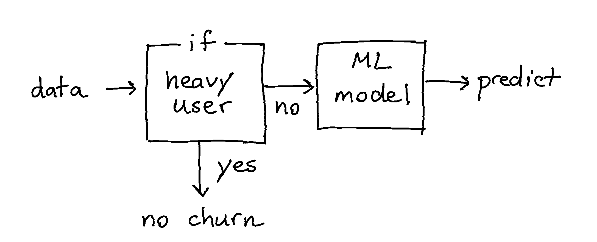

This page contains a list of short examples that demonstrate the utility of
the tools in this package. The goal for each example is to be small and consise.

## Precision and Subgroups

It can be the case that for a subgroup of the population you do not need a model.
Suppose that we have a session log dataset from "World of Warcraft". We know when
people logged in, if they were part of a guild and when they stopped playing. You
can create a machine learning model to predict which players are at risk of quitting
the game but you might also be able to come up with some simple rules.

Here is one rule that might work out swell:

> "If any player was playing the video game at 24:00 on new-years eve,
odds are that this person is very invested in the game and won't stop playing."

This one rule will not cover the entire population but for the subgroup it can be an
effective rule.



As an illustrative example we'll implement this diagram as a `Classifier`.

```python
import numpy as np
from hulearn.outlier import InteractiveOutlierDetector
from hulearn.classification import FunctionClassifier, InteractiveClassifier


classifier = SomeScikitLearnModel()

def make_decision(dataf):
    # First we create a resulting array with all the predictions
    res = classifier.predict(dataf)

    # Override model prediction if a user is a heavy_user, no matter what
    res = np.where(dataf['heavy_user'], "stays", res)

    return res

fallback_model = FunctionClassifier(make_decision)
```

## No Data No Problem

Let's say that we're interested in detecting fraud at a tax office. Even without
looking at the data we can already come up with some sensible rules.

- Any minor making over the median income is "suspicious".
- Any person who started more than 2 companies in a year is "suspicious".
- Any person who has more than 10 bank accounts is "suspicious".

The thing with these rules is that they are easy to explain but they are not based
on data at all. In fact, they may not occur in the data at all. This means that
a machine learning model may not have picked up this pattern that we're interested
in. Thankfully, the lack in data can be compensated with business rules.


## Comfort Zone

Models typically have a "comfort zone". If a new data point comes in that is
very different from what the models saw before it should not be treated the same way.
You can also argue that points with low `proba` score should also not be
automated.

If you want to prevent predictions where the model is "unsure" then you
might want to follow this diagram;


You can construct such a system by creating a `FunctionClassifier` that
handles the logic you require. As an illustrative example we'll implement
this diagram as a `Classifier`.

```python
import numpy as np
from hulearn.outlier import InteractiveOutlierDetector
from hulearn.classification import FunctionClassifier, InteractiveClassifier

# We're importing a classifier/outlier detector from our library
# but nothing is stopping you from using those in scikit-learn.
# Just make sure that they are trained beforehand!
outlier    = InteractiveOutlierDetector.from_json("path/to/file.json")
classifier = InteractiveClassifier.from_json("path/to/file.json")

def make_decision(dataf):
    # First we create a resulting array with all the predictions
    res = classifier.predict(dataf)

    # If we detect doubt, "classify" it as a fallback instead.
    proba = classifier.predict_proba(dataf)
    res = np.where(proba.max(axis=1) < 0.8, "doubt_fallback", res)

    # If we detect an ourier, we'll fallback too.
    res = np.where(outlier.predict(dataf) == -1, "outlier_fallback", res)

    # This `res` array contains the output of the drawn diagram.
    return res

fallback_model = FunctionClassifier(make_decision)
```

For more information on why this tactic is helpful:

- [blogpost](https://koaning.io/posts/high-on-probability-low-on-certainty/)
- [pydata talk](https://www.youtube.com/watch?v=Z8MEFI7ZJlA)
