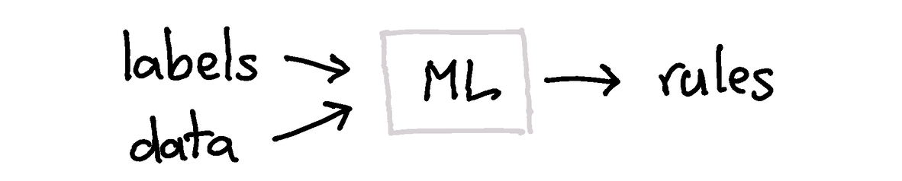

# Frequently Asked Questions

Feel free to ask questions [here](https://github.com/koaning/human-learn/issues).

## What are the Lessons Learned

If you're interested in some of the lessons the creators of this tool learned
while creating it, all you need to do is follow the python tradition.

```python
from hulearn import this
```

## Why Make This?

Back in the old days, it was common to write rule-based systems. Systems that do;


Nowadays, it's much more fashionable to use machine learning instead. Something like;



We started wondering if we might have lost something in this transition. Sure,
machine learning covers a lot of ground. But we've reached a stage of hype
that folks forget that many classification problems can be handled by natural intelligence too.

This made us wonder if we could make machine learning listen more to common sense.
There's a lot of things that could go wrong otherwise. If you're interested in
examples we might recommend [this pydata talk](https://www.youtube.com/watch?v=Z8MEFI7ZJlA).

## I'm getting a PORT error!

You might get an error that looks like;

```python
ERROR:bokeh.server.views.ws:Refusing websocket connection from Origin 'http://localhost:8889';
use --allow-websocket-origin=localhost:8889 or set BOKEH_ALLOW_WS_ORIGIN=localhost:8889
to permit this; currently we allow origins {'localhost:8888'}
```

This is [related](https://github.com/bokeh/bokeh/issues/8096#issuecomment-406815954) to something
bokeh cannot do without explicit permission from jupyter. It can't be fixed by this library but you
can circumvent this error by running jupyter via;

```
python -m jupyter lab --port 8889 --allow-websocket-origin=localhost:8889
```

You can also set an environment variable `BOKEH_ALLOW_WS_ORIGIN=localhost:8889`.
