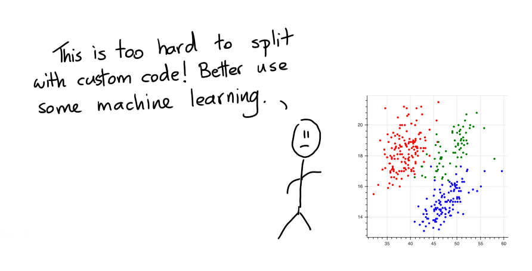

# Drawing as a Model

## Classic Classification Problem

Let's look at a dataset that describes a classification problem. In particular, we're looking at the
[pallmer penguin dataset](https://github.com/allisonhorst/palmerpenguins) here.


The goal is to predict the colors of the points. Very commonly folks would look at this and say;



But maybe, this is a wrong interpretation. Maybe the problem isn't the fact
that as a human we can't split up the points. Instead the problem here is
that code is not the best user-interface. Sure, writing the code to split
the points is hard but if we could just draw, it'd be much easier.

## Let's Draw!

Because we've got the web at our disposal and tools like [bokeh](https://docs.bokeh.org/en/latest/index.html)
we can also turn the static chart into an interactive one. The nice thing
about interactive charts is that we can interact with them. The chart below
allows you to draw on the canvas.

<iframe src="chart.html" style="width:500px; height: 420px; border: 0px;""></iframe>

### Instructions

To draw, you first need to pick a color. Then you can double click in the canvas
to start drawing a polygon. Once you're done drawing you can double click again
to stop shaping the polygon. A drawn polygon can be moved by clicking and dragging.
You can delete a polygon by clicking it once and hitting backspace. You can also edit
it by clicking the edit button (immediately under the green button). You can delete
a polygon by first clicking the polygon once and then hitting backspace.

Once you're done drawing you might end up with a drawing that looks like this.


When you look at it such a drawing. It makes you wonder, wouldn't it be nice if
this was the output of a machine learning model?

## Properties of Modelling Technique

Instead of doing machine learning we're doing "human learning" here. We can literally
draw out what we think the computer should predict and there's some interesting benefits
to consider.

1. By drawing on the data, you're immediately forced to understand it. The act of modelling now also includes the act
of exploratory analysis.
2. By drawing the model, you immediately interpret and understand it better. This is great when you think about
themes like fairness. It's still not 100% perfect but the added interpretability should make it a lot easier to
prevent artificial stupidity.
3. You can draw on the canvas, even if there's no data! This is something that machine learning algorithms typically
have the worst time ever with. If you're doing fraud modelling, then you can manually specify a region to be "risky"
even when there is no data for it!
4. You can draw on the canvas, even if there's no labels! You might be able to come up with a "common sense" drawing
even if there are no labels available. The model will be fully heuristic based, but perhaps still useful.
5. We can interpret the drawing in many ways. Maybe if you've not drawn a region we can interpret it as "wont predict here".
This can be a like-able safety mechanism.
6. If nothing else, these drawings should serve as a lovely benchmark. If the performance of your deep ensemble model
isn't significantly better than a drawn model, then you may not need the complex model.

## From Jupyter

In reality one 2D chart is probably not going to cut it. So in a jupyter notebook you can drawn many! Here's how it works.

```python
from sklego.datasets import load_penguins
from hulearn.experimental.interactive import InteractiveCharts

df = load_penguins(as_frame=True).dropna()
clf = InteractiveCharts(df, labels="species")
```

The `clf` variable contains a `InteractiveCharts` object that has assumed that the `"species"` column in `df`
to represent the label that we're interested in. From here you can generate charts, via;

```python
# It's best to run this in a single cell.
clf.add_chart(x="bill_length_mm", y="bill_depth_mm")
```

You can also generate a second chart.

```python
# Again, run this in a seperate cell.
clf.add_chart(x="flipper_length_mm", y="body_mass_g")
```

This will generate two interactive charts where you can "draw" you model. The final drawn result might look
something like this;


## Serialize

You can translate these decision boundaries to a machine learning model if you want. To do that you first need to
translate your drawings to json.

```python
drawn_data = clf.data()
# You can also save the data to disk if you want.
clf.to_json("drawn-model.json")
```

<details>
  <summary><b>What the json file looks like.</b></summary>
```javascript
[{'chart_id': '3c680a70-0',
  'x': 'bill_length_mm',
  'y': 'bill_depth_mm',
  'polygons': {'Adelie': {'bill_length_mm': [[32.14132787891895,
      32.84074984423687,
      38.78583654943918,
      46.829189150595255,
      47.17890013325422,
      43.68179030666462,
      35.63843770550855]],
    'bill_depth_mm': [[15.406862190509665,
      19.177207018095874,
      21.487207018095873,
      21.5934139146476,
      19.217943123601575,
      16.640631196069247,
      15.244587235322568]]},
   'Gentoo': {'bill_length_mm': [[58.10736834134671,
      50.501154468514336,
      40.18468048007502,
      40.09725273441028,
      44.556067763312015,
      53.12398683845653,
      58.894218052329364,
      60.76142402357685]],
    'bill_depth_mm': [[17.284959177952327,
      17.553429170403614,
      14.627106252684614,
      13.201081726611287,
      12.051605398390103,
      13.827533449580619,
      15.667347786949287,
      17.024587871893388]]},
   'Chinstrap': {'bill_length_mm': [[44.11892903498832,
      40.88410244539294,
      45.51777296562416,
      51.72514290782069,
      56.621096665046124,
      58.019940595681966,
      53.29884232978601,
      52.511992618803355,
      47.004044641924736]],
    'bill_depth_mm': [[16.103691211166677,
      16.72117219380463,
      19.217943123601575,
      20.85561007755441,
      21.124080070005693,
      19.540107114543115,
      18.57361514171849,
      16.39900820286309,
      15.915762216450778]]}}},
 {'chart_id': '198b23fb-5',
  'x': 'flipper_length_mm',
  'y': 'body_mass_g',
  'polygons': {'Adelie': {'flipper_length_mm': [[205.39985750238202,
      205.39985750238202,
      184.0772104628077,
      174.80649435864495,
      170.235872105095,
      161.6171609214579,
      174.42229536301556,
      194.38496200094178,
      197.57898866300997,
      209.5565886457657,
      204.4993797641577]],
    'body_mass_g': [[4079.2264346061725,
      4876.092877056334,
      4876.092877056334,
      4067.842628285456,
      3521.4199248910595,
      3088.8352847038286,
      2781.4725140444807,
      2781.4725140444807,
      3134.370509986695,
      3555.5713438532093,
      3737.7122449846747]]},
   'Gentoo': {'flipper_length_mm': [[208.77192413146238,
      201.53909280616116,
      216.39571931218526,
      232.7342009323645,
      241.9517683831975,
      222.55068229508308]],
    'body_mass_g': [[3898.03455221242,
      4740.103517729661,
      6171.487627453468,
      6230.793172902075,
      5650.448345315868,
      4603.5517935917305]]},
   'Chinstrap': {'flipper_length_mm': [[215.1341094117529,
      195.202069787803,
      173.41588694302055,
      181.06422772895482,
      197.75151671644775,
      212.35289458050406]],
    'body_mass_g': [[4330.448345315868,
      4626.310414281385,
      3272.1724832469026,
      2698.5776834613475,
      2872.5429646102134,
      3646.641794418942]]}}}]
```
</details>

This data represents the drawings that you've made.

## Model

This generated data can be read in by our `InteractiveClassifier` which will allow you to use your drawn model
as a scikit-learn model.

```python
from hulearn.classification import InteractiveClassifier

model = InteractiveClassifier(json_desc=drawn_data)
# Alternatively you can also load from disk.
InteractiveClassifier.from_json("drawn-model.json")
```

This model can be used to make predictions but you will still need to follow the standard `.fit(X, y)` and `.predict(X)` pattern.

```python
X, y = df.drop(columns=['species']), df['species']

preds = model.fit(X, y).predict_proba(X)
```

We can confirm that it has picked up the pattern that we drew too! The charts below show the predicted values
`preds` plotted over the original charts that we drew.


<details>
  <summary><b>Code for the plots.</b></summary>
```python
import matplotlib.pylab as plt

plt.figure(figsize=(12, 3))
for i in range(3):
    plt.subplot(131 + i)
    plt.scatter(X['bill_length_mm'], X['bill_depth_mm'], c=preds[:, i])
    plt.xlabel('bill_length_mm')
    plt.ylabel('bill_depth_mm')
    plt.title(model.classes_[i])

import matplotlib.pylab as plt

plt.figure(figsize=(12, 3))
for i in range(3):
    plt.subplot(131 + i)
    plt.scatter(X['flipper_length_mm'], X['body_mass_g'], c=preds[:, i])
    plt.xlabel('flipper_length_mm')
    plt.ylabel('body_mass_g')
    plt.title(model.classes_[i])
```
</details>

Because we've been drawing on two charts you should notice that the predictions won't match our drawings 100%. Internally
we check if a point falls into a drawn polygon and a single point typically fits into more than a single polygon. If a point
does not fit into any polygon then we assign a flat probability value to it.

The details of how points in polygons are weighted will be explored with hyperparemters that will be added to the API.

## Conclusion

The goal of this library is to make it easier to apply common sense to construct models. By thinking more in terms of
"human learning" as opposed to "machine learning" you might be able to make models that are guaranteed to follow the rules.

Is this way of modelling perfect? No. Human made rules can also be biased and we should also
consider that this model still needs to undergo testing via a validation set. You still need to "think" when designing
rule based systems.

### Notebook

If you want to run this code yourself, feel free to download the [notebook](../notebooks/03-interactive.ipynb).
