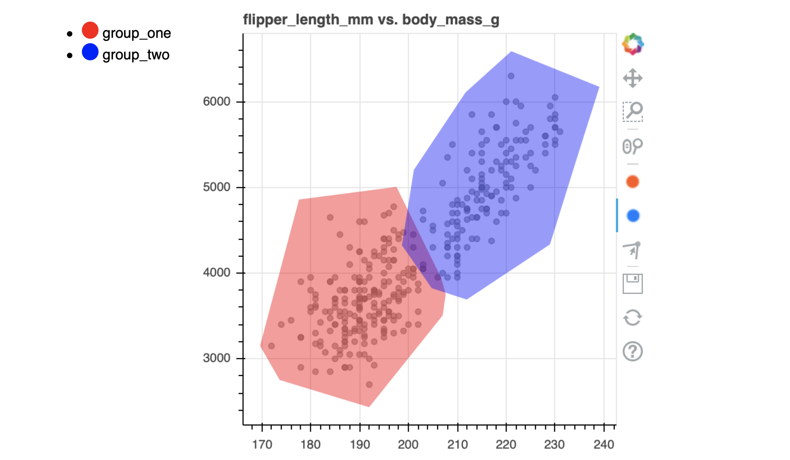

Sofar we've explored drawing as a tool for models, but it can also be used
as a tool to generate features. To explore this, let's load in the penguins
dataset again.

```python
from sklego.datasets import load_penguins

df = load_penguins(as_frame=True).dropna()
```

## Drawing

We can draw over this dataset. It's like before but with one crucial differenc

```python
from hulearn.experimental.interactive import InteractiveCharts

# Note that the `labels` arugment here is a list, not a string! This
# tells the tool that we want to be able to add custom groups that are
# not defined by a column in the dataframe.
charts = InteractiveCharts(df, labels=['group_one', 'group_two'])
```

Let's make a custom drawing.

```python
charts.add_chart(x="flipper_length_mm", y="body_mass_g")
```

Let's assume the new drawing looks something like this.



Sofar these drawn features have been used to construct models. But they
can also be used to help label data or generate extra features for machine
learning models.

## Features

This library makes it easy to add these features to scikit-learn
pipelines or to pandas. To get started, you'll want to import the
`InteractivePreprocessor`.

```python
from hulearn.preprocessing import InteractivePreprocessor
tfm = InteractivePreprocessor(json_desc=charts.data())
```

This `tfm` object is can be used as a preprocessing step inside of
scikit-learn but it can also be used in a pandas pipeline.

```python
# The flow for scikit-learn
tfm.fit(df).transform(df)
# The flow for pandas
df.pipe(tfm.pandas_pipe)
```
