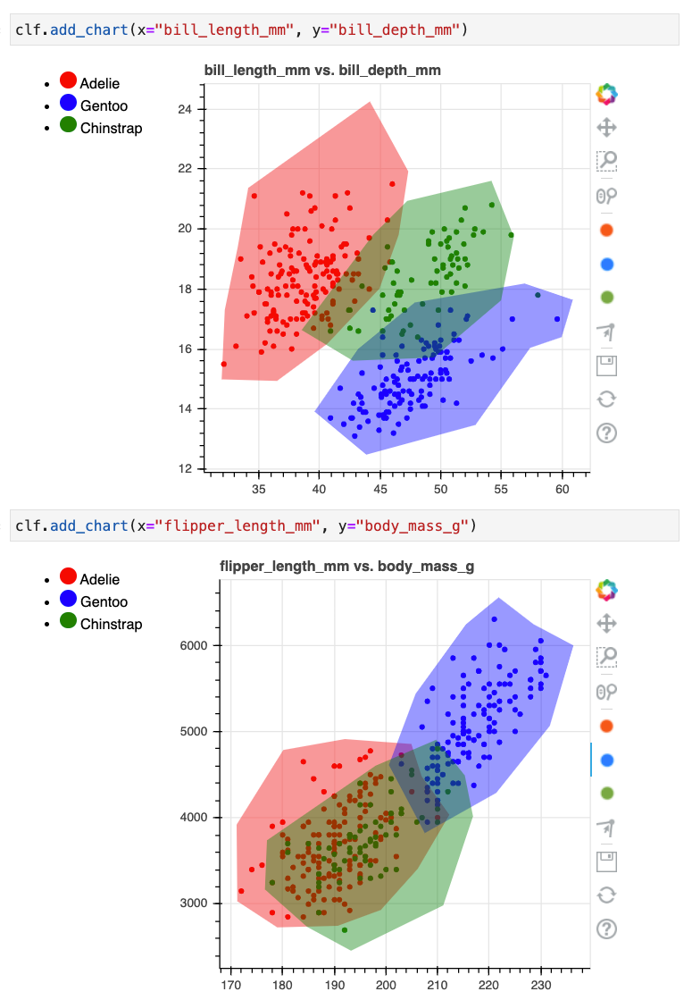
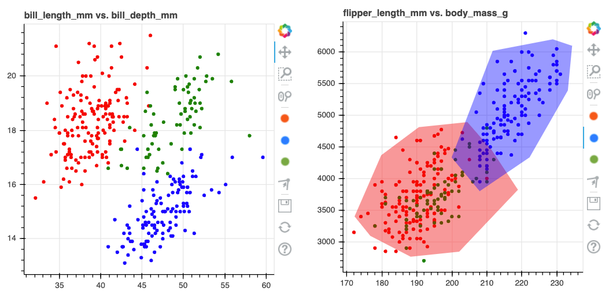
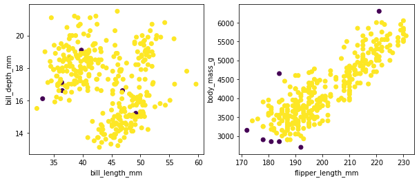
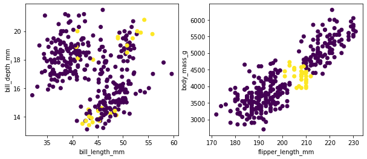

## Rethinking Classification

Let's have another look at the interactive canvas that we saw in the previous guide.

```python
from sklego.datasets import load_penguins
from hulearn.experimental.interactive import InteractiveCharts

df = load_penguins(as_frame=True).dropna()
clf = InteractiveCharts(df, labels="species")
```



The drawn colors indicate that a human deemed a classification appropriate. You could wonder
what we might want to do with the regions that have not been colored though. Machine learning
algorithms might typically still assign a class to those regions but that can be a dangerous idea.


We might consider these points outside of the "comfort zone" of the predicted areas. In these situations
it might be best to declare it an outlier and to handle it differently. That way we don't automate a
decision that we're likely to regret later.

## Outliers

The drawn charts can be used to construct a classifier but they may also be used to construct an
outlier detection model. This allows us to re-use earlier work for multiple purposes.

```python
from sklego.datasets import load_penguins
from hulearn.experimental.interactive import InteractiveCharts

df = load_penguins(as_frame=True).dropna()

charts = InteractiveCharts(df, labels="species")

# Run this in a seperate cell
charts.add_chart(x="bill_length_mm", y="bill_depth_mm")

# Run this in a seperate cell
charts.add_chart(x="flipper_length_mm", y="body_mass_g")
```

To demonstrate how it works, let's assume that we've drawn the following:



We'll again fetch the drawn data but now we'll use it to detect outliers.

```python
from hulearn.outlier import InteractiveOutlierDetector

# Load the model using drawn-data.
model = InteractiveOutlierDetector(json_desc=charts.data())

X, y = df.drop(columns=['species']), df['species']
preds = model.fit(X, y).predict(X)
```

This model can now be used as a scikit-learn compatible outlier detection model.
Here's the output of the model.



<details>
  <summary><b>Code for the plots.</b></summary>
    ```python
    import matplotlib.pylab as plt

    plt.figure(figsize=(10, 4))
    plt.subplot(121)
    plt.scatter(X['bill_length_mm'], X['bill_depth_mm'], c=preds)
    plt.xlabel('bill_length_mm')
    plt.ylabel('bill_depth_mm')
    plt.subplot(122)
    plt.scatter(X['flipper_length_mm'], X['body_mass_g'], c=preds)
    plt.xlabel('flipper_length_mm')
    plt.ylabel('body_mass_g');
    ```
</details>

### How it works.

A point is considered an outlier if it does not fall inside of enough drawn polygons. The number
of poylgons that a point must fall into is a parameter that you can set manually or even search
for in a grid-search. For example, let's repeat the exercise. The base setting is that a point needs
to be in at least one polygon but we can change this to two.

```python
# Before
model = InteractiveOutlierDetector(json_desc=charts.data(), threshold=1)
# After
model = InteractiveOutlierDetector(json_desc=charts.data(), threshold=2)
```



## Combine

You might wonder, can we combine the `FunctionClassifier` with an outlier model like
we've got here? Yes! Use a `FunctionClassifier`!


As an illustrative example we'll implement a diagram like above as a `Classifier`.

```python
import numpy as np
from hulearn.outlier import InteractiveOutlierDetector
from hulearn.classification import FunctionClassifier, InteractiveClassifier

outlier    = InteractiveOutlierDetector.from_json("path/to/file.json")
classifier = InteractiveClassifier.from_json("path/to/file.json")

def make_decision(dataf):
    # First we create a resulting array with all the predictions
    res = classifier.predict(dataf)

    # If we detect doubt, "classify" it as a fallback instead.
    proba = classifier.predict_proba(dataf)
    res = np.where(proba.max(axis=1) < 0.8, "doubt_fallback", res)

    # If we detect an ourier, we'll fallback too.
    res = np.where(outlier.predict(dataf) == -1, "outlier_fallback", res)

    # This `res` array contains the output of the drawn diagram.
    return res

fallback_model = FunctionClassifier(make_decision)
```
