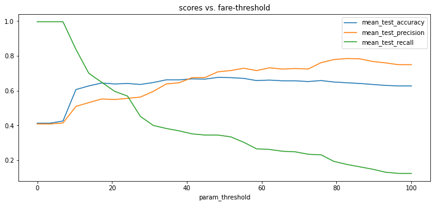

The goal of this library is to make it easier to declare common sense models. 
A very pythonic way of getting there is to declare a function. One of the first features
in this library is the ability to re-use functions as if they are scikit-learn models.

## Titanic

Let's see how this might work. We'll grab a dataset that is packaged along 
with this library.   

```python
from hulearn.datasets import load_titanic

df = load_titanic(as_frame=True)
df.head()
```

The `df` variable represents a dataframe and it has the following contents:

|   survived |   pclass | sex    |   age |    fare |   sibsp |
|-----------:|---------:|:-------|------:|--------:|--------:|
|          0 |        3 | male   |    22 |  7.25   |       1 |
|          1 |        1 | female |    38 | 71.2833 |       1 |
|          1 |        3 | female |    26 |  7.925  |       0 |
|          1 |        1 | female |    35 | 53.1    |       1 |
|          0 |        3 | male   |    35 |  8.05   |       0 |

There's actually some more columns in this dataset but we'll limit ourselves 
to just these for now. The goal of the dataset is to predict if you survived 
the titanic disaster based on the other attributes in this dataframe.

### Preparation

To prepare our data we will first get it into the common `X`, `y` format for 
scikit-learn.

```python
X, y = df.drop(columns=['survived']), df['survived']
```

We could now start to import fancy machine learning models. It's what a lot of 
people do. Import a random forest, and see how high we can get the accuracy 
statistics. The goal of this library is to do the exact opposite. It might be a 
better idea to create a simple benchmark using, well, common sense? 

It's the goal of this library to make this easier for scikit-learn. In part 
because this helps us get to sensible benchmarks but also because this exercise 
usually makes you understand the data a whole lot better. 

### FunctionClassifier 

Let's write a simple python function that determines if you survived based on the amount
of money you paid for your ticket. It might serve as a proxy for your survival rate. To get
such a model to act as a scikit-learn model you can use the `FunctionClassifier`. You can see
an example of that below. 

```python
import numpy as np
from hulearn.classification import FunctionClassifier

def fare_based(dataf, threshold=10):
    """
    The assumption is that folks who paid more are wealthier and are more
    likely to have recieved access to lifeboats.
    """
    return np.array(dataf['fare'] > threshold).astype(int)

mod = FunctionClassifier(fare_based)
```

This `mod` is a scikit-learn model, which means that you can `.fit(X, y).predict(X)`. 

```python
mod.fit(X, y).predict(X)
```

During the `.fit(X, y)`-step there's actually nothing being "trained" but it's a scikit-learn
formality that every model has a "fit"-step and a "predict"-step.  

### Grid 

Being able to `.fit(X, y).predict(X)` is nice. We could compare the predictions with the true
values to get an idea of how well our heuristic works. But how do we know if we've picked the 
best `threshold` value? For that, you might like to use `GridSearchCV`. 

```python
from sklearn.model_selection import GridSearchCV
from sklearn.metrics import precision_score, recall_score, accuracy_score, make_scorer

# Note the threshold keyword argument in this function.
def fare_based(dataf, threshold=10):
    return np.array(dataf['fare'] > threshold).astype(int)

# Pay attention here, we set the threshold argument in here. 
mod = FunctionClassifier(fare_based, threshold=10)

# The GridSearch object can now "grid-search" over this argument.
# We also add a bunch of metrics to our approach so we can measure.
grid = GridSearchCV(mod, 
                    cv=2, 
                    param_grid={'threshold': np.linspace(0, 100, 30)},
                    scoring={'accuracy': make_scorer(accuracy_score), 
                             'precision': make_scorer(precision_score),
                             'recall': make_scorer(recall_score)},
                    refit='accuracy')
grid.fit(X, y)
``` 

If we make a chart of the `grid.cv_results_` then they would look something like;



A precision of 80% is not bad! It confirms our hunch that the folks who paid more for their ticket
(potentially those in 1st class) had a better chance of surviving. An interesting thing to mention is
that if you were to train a `RandomForestClassifier` using the `'pclass', 'sex', 'age', 'fare'` columns
that you wouldn't get such a high precision. 

### Bigger Grids

You can also come up with bigger grids that use multiple arguments of the function. We totally allow
for that.

```python
def last_name(dataf, sex='male', pclass=1):
    predicate = (dataf['sex'] == sex) & (dataf['pclass'] == pclass)
    return np.array(predicate).astype(int)

# Once again, remember to declare your arguments here too! 
mod = FunctionClassifier(last_name, pclass=10, sex='male')

# The arguments of the function can now be "grid-searched".
grid = GridSearchCV(mod, 
                    cv=2, 
                    param_grid={'pclass': [1, 2, 3], 'sex': ['male', 'female']},
                    scoring={'accuracy': make_scorer(accuracy_score), 
                             'precision': make_scorer(precision_score),
                             'recall': make_scorer(recall_score)},
                    refit='accuracy')
grid.fit(X, y)
```

## Conclusion 

In this guide we've seen the `FunctionClassifier`. It is one of the many models in this
library that will help you construct more "human" models.

### Notebook 

If you want to download with this code yourself, feel free to download the 
notebook [here](notebooks/01-function-classifier.ipynb). 