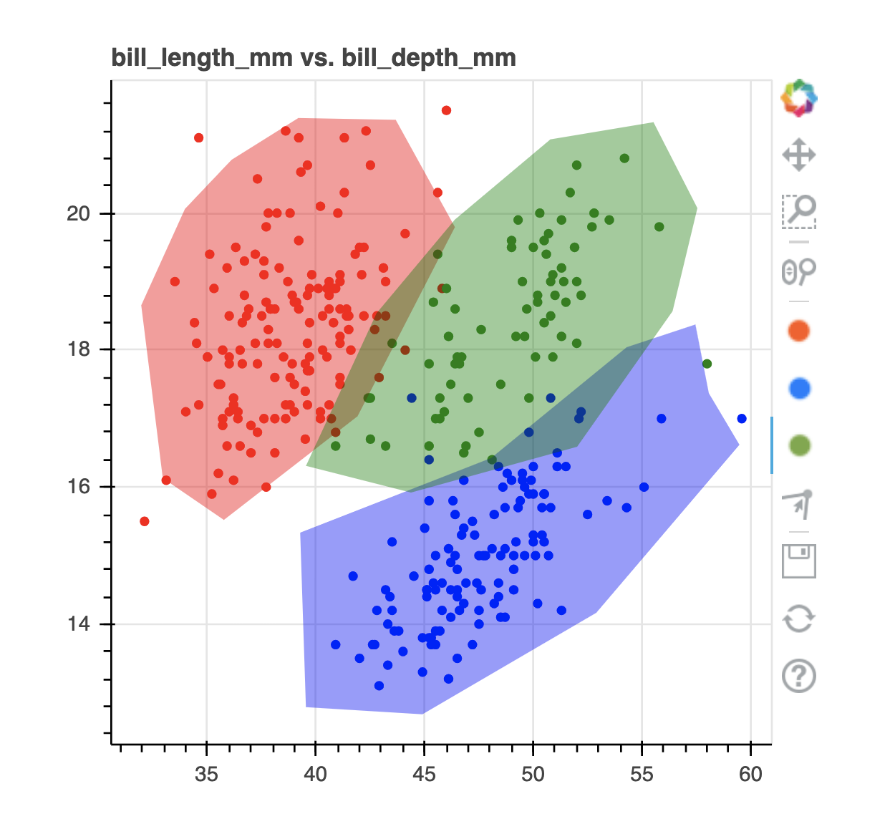

# Summary

This package contains scikit-learn compatible tools that make it easier to construct and benchmark rule based systems that are designed by humans. There's tools to turn python functions into scikit-learn compatible components as well as interactive jupyter widgets that allow the user to draw models. It can also be used to design rules on top of existing models that, for example, can trigger a classifier fallback when outliers are detected.

# Statement of need

There's been a transition from rule-based systems to ones that use machine-learning. We started wondering if we might have lost something in this transition. Machine learning can be generally applied but it is also capable of making bad decision that are very hard to understand. Even with the benefit of hindsight. Many classification problems can be handled by natural intelligence too. The goal of this package is to make it easier to turn the act of exploratory data analysis into a benchmark model.

# Figures

The user interface that can be used to draw machine learning models is drawn below. Note that the same UI can also be used for labelling tasks as well.

# Acknowledgements

This project was developed in my spare time while being employed at Rasa. They have been very supportive of me working on my own projects on the side and I would like to recognise them for being a great employer.

I also want to acknowledge that I'm building on the shoulders of giants. The popular drawing widget in this library would not have been made possible without the wider bokeh, jupyter and ipywidgets communities.

There have been also been small contributions on Github from Joshua Adelman, Kay Hoogland and Gabriel Luiz Freitas Almeida.

# References
